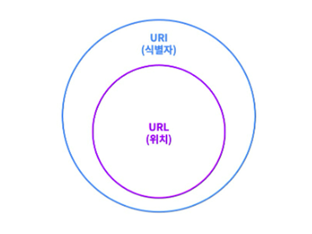
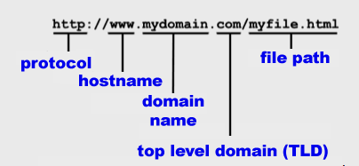

# Network - 웹 서비스 구조

1. [URL과 URI](#url과-uri)
2. [호스트 네임과 도메인 네임](#호스트-네임과-도메인-네임)

## URL과 URI
웹 기술을 사용하여 통신하는 웹 서비스의 흐름에 필요한 개념 중 하나이다.

- URL : Uniform **Resource** Identifier
- URI : Uniform **Resource** Locator

우리가 웹 서비스를 사용할 때, 변하는 모든 것들은 자원(Resource)이라고  
칭할 수 있다.
- 마이페이지 조회 : 서버에게 내 정보라는 **자원**을 요청한다.
- 콘서트 좌석 예매 : 서버에게 내가 보고 싶은 공연의 좌석이라는 **자원**을 저장할 것을 요청한다.

**결론부터 말하자면, URL은 URI이지만, URI는 무조건 URL이라 할 수는 없다.**

refs) https://www.elancer.co.kr/blog/view?seq=74

`naver.com`은 수많은 서버 중 하나를 지칭하기에 이는 리소스를 식별하는 URI이다. 하지만 URL은 될 수가 없다.

### URL의 특징
URL은 네트워크 통신을 통해 해당 자원에 접근하기 위한 방법을 표기하고 있다.
  - URL은 네트워크 프로토콜(http, https, sftp 등) 정보를 갖고 있다.
> google.com …is a URI because it is only the name of a resource.  
https://google.com …is a URL because it’s both the name and how to get there
>
>refs) https://danielmiessler.com/p/difference-between-uri-url/

## 호스트 네임과 도메인 네임
`FQDN`이라는 표기법을 사용하면 호스트 네임과 도메인 네임을 함께 나타낼 수 있다.  
우리는 네이버에서 `뉴스`, `메일`에 들어갈 때마다  
 `naver.com`은 동일하되, 앞부분이 각각 `news`, `mail`로 달라진다.  
 - 네이버 뉴스 : https://news.naver.com
 - 네이버 메일 : https://mail.naver.com

위 예시를 통해 우리가 직관적으로 이해할 수 있는건 다음과 같다.  
>네이버(`naver.com`)에서 제공하는 서비스들을 명칭(`news`, `mail`)으로 구분하고 있다.

### 호스트 네임
호스트 네임은 네트워크에 속한 각각의 장치(ex. 컴퓨터)를 구분하기 위한 이름이다.  
풀네임(FQDN)에서 제일 앞 부분에 오는 이름에 해당하며, 위 예시에서는  
`news`, `mail`이 호스트 네임에 해당한다.

> A hostname allows people to find specific devices on a network. For example, this may be needed to gain access to an email server. It may look something like mail.acme.org. Here, the part of this address that says “mail” is the hostname.
>
> refs) https://www.onlydomains.com/blog/hostname-vs-domain-name/

### 도메인 네임
우리는 `naver.com`에 접속할 때, 해당 서버의 IP 주소를 입력하지 않는다.  
만약 `naver.com`의 IP 주소가 `165.178.231`이라면 naver 서비스는  
많은 사람들로부터 이용될 수 없었을 것이다.

도메인 네임의 목적은 사람들에게 기억하기 쉽고, 식별하기 쉽도록 하는 것이다.  
따라서 회사의 비즈니스를 통용하는 용어를 사용해서 도메인 네임을 부여한다.  

또한 도메인 네임은 하나의 네트워크를 지칭하기도 한다.  
`naver.com`이라는 도메인 네임은 네이버와 관련된 기능들을 제공하는  
서버들을 포함한 네트워크를 가리키기도 한다.

### 서브 도메인과 호스트 네임
하나의 도메인은 여러 개의 서브 도메인을 포함할 수 있다.  
`naver.com`은 `mail.naver.com`, `news.naver.com` 등으로 나뉘어질 수 있다.  
이렇게 나뉘어 지는 각각의 도메인을 서브 도메인이라고 한다.  
그리고 각각의 서브 도메인에서 맨 앞부분, 각각의 서버를 구분하기 위한  
이름을 호스트 네임이라고 한다.

refs) https://encyclopedia2.thefreedictionary.com/Host+name

### 참고 자료
1. [면접 전에 알고 가면 좋을 것들](https://www.inflearn.com/course/%EB%A9%B4%EC%A0%91-%EC%8B%A0%EC%9E%85-java-%EB%B0%B1%EC%95%A4%EB%93%9C-%EA%B0%9C%EB%B0%9C%EC%9E%90/dashboard)